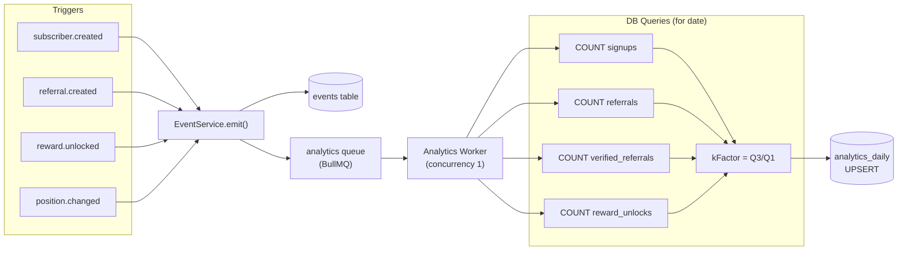

# Analytics System

The analytics system provides three layers of data: real-time Redis-cached metrics for dashboards, daily time-series aggregates written by the Analytics Worker, and cohort analysis tables for deeper growth analysis.

---

## Overview: What is Tracked

| Metric | Source | Freshness |
|---|---|---|
| Total signups | DB count query | 5 min (cached) |
| Today's signups | DB count query | 5 min (cached) |
| Total referrals | DB count query | 5 min (cached) |
| Today's referrals | DB count query | 5 min (cached) |
| K-factor | Computed from DB | 5 min (cached) |
| Conversion rate | Computed from DB | 5 min (cached) |
| Spots remaining | DB count + config | 5 min (cached) |
| Daily signups / referrals | `analytics_daily` | Near real-time (event-driven) |
| Daily k-factor | `analytics_daily` | Near real-time (event-driven) |
| Daily reward unlocks | `analytics_daily` | Near real-time (event-driven) |
| Cohort referral rates | `analytics_cohorts` | Manual / scheduled |
| Channel breakdown | DB aggregation | On-demand (no cache) |
| Leaderboard | DB aggregation | 1 min (cached) |

---

## Real-Time Metrics (Redis-Cached)

### Overview Endpoint Cache

`GET /api/v1/admin/analytics/overview?projectId=<uuid>`

Cache key: `analytics:overview:<projectId>`
TTL: `ANALYTICS_CACHE_TTL = 300` seconds (5 minutes)

Four parallel COUNT queries run against the live database:

```typescript
const [
  totalSignupsResult,    // COUNT(*) FROM subscribers WHERE project_id=?
  todaySignupsResult,    // COUNT(*) WHERE project_id=? AND DATE(created_at) = today
  totalReferralsResult,  // COUNT(*) FROM referrals WHERE project_id=?
  todayReferralsResult,  // COUNT(*) WHERE project_id=? AND DATE(created_at) = today
] = await Promise.all([...]);

const conversionRate = totalReferrals / totalSignups;  // rounded to 4dp
const kFactor        = totalReferrals / totalSignups;  // same formula at this endpoint
```

Response shape:
```typescript
interface AnalyticsOverview {
  totalSignups: number;
  todaySignups: number;
  totalReferrals: number;
  todayReferrals: number;
  conversionRate: number; // 4 decimal places
  kFactor: number;        // 4 decimal places
}
```

### Public Stats Cache

`GET /api/v1/stats`

Cache key: `stats:<projectId>`
TTL: `ANALYTICS_CACHE_TTL = 300` seconds

```typescript
interface PublicStats {
  totalSignups: number;
  spotsRemaining: number | null; // null if no maxSubscribers configured
  referralsMade: number;
}
```

### Leaderboard Cache

`GET /api/v1/leaderboard`

Cache key: `leaderboard:<projectId>:<limit>`
TTL: `LEADERBOARD_CACHE_TTL = 60` seconds (1 minute)

The leaderboard query does a LEFT JOIN between `subscribers` and `referrals`, groups by `subscriber.id`, filters to `HAVING COUNT(referrals.id) > 0`, and orders descending by referral count.

---

## Time-Series Data (`analytics_daily`)

### Table Structure

Each row represents one day of activity for one project:

| Column | Description |
|---|---|
| `project_id` | Project scope |
| `date` | `YYYY-MM-DD` ISO date string |
| `signups` | New subscribers that day |
| `referrals` | New referral records that day |
| `verified_referrals` | Referrals with `verified=true` that day |
| `k_factor` | `verified_referrals / signups`, rounded to 2dp |
| `reward_unlocks` | Tier unlocks that day |

### How It is Written

Every call to `EventService.emit()` enqueues an `analytics` job. The Analytics Aggregator Worker processes this job by:

1. Extracting `YYYY-MM-DD` from the event timestamp.
2. Running four COUNT queries against the source tables for that full calendar day.
3. Upserting into `analytics_daily` on conflict `(project_id, date)`.

Because the worker has concurrency 1 and the upsert is idempotent, multiple events on the same day simply recompute and overwrite — no double-counting.

### Aggregation Pipeline



### Querying the Time-Series

```bash
curl "http://localhost:3400/api/v1/admin/analytics/timeseries?projectId=<uuid>&from=2025-01-01&to=2025-03-31" \
  -H "Authorization: Bearer $TOKEN"
```

Returns rows ordered by `date` ascending. Each row is a full `analytics_daily` record.

---

## Cohort Analysis (`analytics_cohorts`)

### Table Structure

| Column | Description |
|---|---|
| `cohort_week` | ISO date of the Monday of the signup week (`YYYY-MM-DD`) |
| `size` | Number of subscribers who signed up that week |
| `referred_1d` | Referrals generated within 1 day of signup |
| `referred_7d` | Referrals generated within 7 days of signup |
| `referred_30d` | Referrals generated within 30 days of signup |
| `depth_1` | Direct referrals (1 hop from cohort) |
| `depth_2` | 2nd-degree referrals |
| `depth_3` | 3rd-degree+ referrals |

### How to Read Cohort Data

A row with `cohort_week = "2025-01-06"` and `referred_7d = 45` means that the subscribers who joined the week of Jan 6 collectively made 45 referrals within their first 7 days on the waitlist.

High `referred_1d / size` ratio → the signup flow immediately motivates sharing.
Increasing `referred_7d` vs `referred_1d` → reminder emails or delayed nudges are working.

### Populating Cohort Data

The `analytics_cohorts` table is not currently written by the event-driven workers. It is intended to be populated by a scheduled batch job or manual SQL. Example computation:

```sql
INSERT INTO analytics_cohorts (project_id, cohort_week, size, referred_1d, referred_7d, referred_30d)
SELECT
  s.project_id,
  DATE_TRUNC('week', s.created_at)::date AS cohort_week,
  COUNT(DISTINCT s.id) AS size,
  COUNT(DISTINCT r.id) FILTER (
    WHERE r.created_at <= s.created_at + INTERVAL '1 day'
  ) AS referred_1d,
  COUNT(DISTINCT r.id) FILTER (
    WHERE r.created_at <= s.created_at + INTERVAL '7 days'
  ) AS referred_7d,
  COUNT(DISTINCT r.id) FILTER (
    WHERE r.created_at <= s.created_at + INTERVAL '30 days'
  ) AS referred_30d
FROM subscribers s
LEFT JOIN referrals r ON r.referrer_id = s.id
WHERE s.project_id = $project_id
GROUP BY s.project_id, DATE_TRUNC('week', s.created_at)
ON CONFLICT (project_id, cohort_week) DO UPDATE SET
  size = EXCLUDED.size,
  referred_1d = EXCLUDED.referred_1d,
  referred_7d = EXCLUDED.referred_7d,
  referred_30d = EXCLUDED.referred_30d;
```

---

## Share Channel Breakdown

`GET /api/v1/admin/analytics/channels?projectId=<uuid>`

Groups the `referrals` table by `channel` to show which social surface drives the most conversions:

```sql
SELECT channel, COUNT(*) AS count
FROM referrals
WHERE project_id = $1
GROUP BY channel;
```

Channels: `twitter`, `facebook`, `linkedin`, `whatsapp`, `email`, `copy`, `other`, and `null` (no channel recorded).

---

## A/B Experiment Tracking

Experiments are stored in the `experiments` table and assignments in `experiment_assignments`. Each subscriber is assigned to exactly one variant per experiment (enforced by unique index on `(experiment_id, subscriber_id)`).

Experiments are defined with 2–5 variants, each with a `weight` (0–100). Variant assignment logic (weighted random) is not built into the current API routes — the assignment is stored once it happens externally, or via your application layer reading the `experiments` endpoint and recording assignments.

The `experiment.assigned` webhook event fires when an assignment is recorded, allowing downstream systems to react.

---

## Top Referrers Leaderboard

`GET /api/v1/leaderboard?limit=N`

This is the primary display surface for `viral` mode. The query:

```sql
SELECT s.name, COUNT(r.id) AS referral_count
FROM subscribers s
LEFT JOIN referrals r ON r.referrer_id = s.id
WHERE s.project_id = $1
GROUP BY s.id, s.name
HAVING COUNT(r.id) > 0
ORDER BY referral_count DESC
LIMIT $limit;
```

Note: names may be `null` if subscribers did not provide a name. The response ranks from 1.

Cached at `leaderboard:<projectId>:<limit>` for 60 seconds.

---

## Cache TTLs and Invalidation

| Cache Key | TTL | Invalidated by |
|---|---|---|
| `stats:<projectId>` | 300 s | Automatic expiry only |
| `analytics:overview:<projectId>` | 300 s | Automatic expiry only |
| `leaderboard:<projectId>:<limit>` | 60 s | Automatic expiry only |

There is no explicit cache invalidation on write — all caches use TTL expiry. For real-time dashboards, the 5-minute overview cache may be stale. For most use cases (displaying a counter on a landing page), 5 minutes is acceptable.

To get fresher data, either reduce the TTL constants in `packages/shared/src/constants.ts`, or implement cache-busting on specific write paths (e.g., delete the key from Redis after a subscribe).
