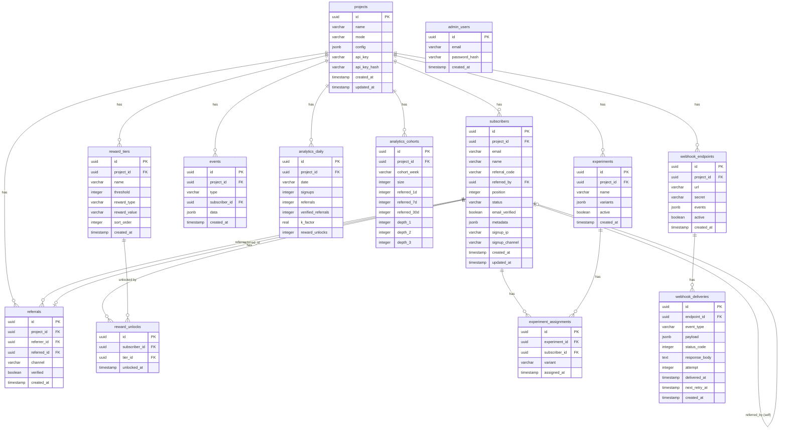
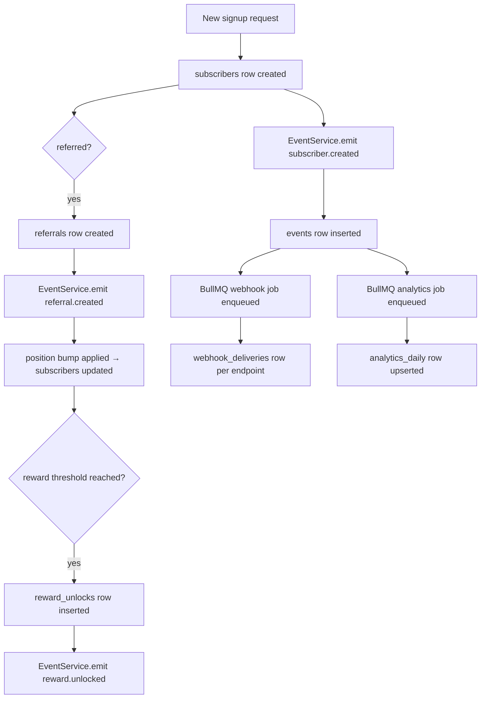

# Database Architecture

The system uses PostgreSQL 16 managed through Drizzle ORM. The schema lives in `apps/api/src/db/schema.ts`. There are **13 tables** across three domains: core waitlist, analytics, and experiments.

---

## Entity-Relationship Diagram



---

## Table-by-Table Documentation

### `projects`

The top-level multi-tenancy unit. Every other table is scoped to a project via `project_id`.

| Column | Type | Nullable | Default | Description |
|---|---|---|---|---|
| `id` | `uuid` | No | `gen_random_uuid()` | Primary key |
| `name` | `varchar(200)` | No | — | Human-readable project name |
| `mode` | `varchar(20)` | No | — | `prelaunch`, `gated`, or `viral` — denormalised from config for fast lookups |
| `config` | `jsonb` | Yes | — | Full `ProjectConfig` object; source of truth for all behaviour flags |
| `api_key` | `varchar(64)` | Yes | — | **Plain-text** key returned once on project creation (prefix `wl_pk_` + 32 nanoid chars). Stored for display only — never used for auth lookups. |
| `api_key_hash` | `varchar(128)` | Yes | — | SHA-256 hex of `api_key`; used for all authentication comparisons |
| `created_at` | `timestamptz` | No | `now()` | — |
| `updated_at` | `timestamptz` | No | `now()` | Updated on every config PUT |

**Indexes:** unique on `api_key` (column-level unique constraint).

**Notes:** `api_key` is stored in plain text because it is shown to the admin on project creation. All authentication comparisons use `api_key_hash` to avoid timing attacks (the hash is looked up; the plain key never participates in WHERE clauses used for auth).

---

### `subscribers`

One row per unique email per project. The central entity.

| Column | Type | Nullable | Default | Description |
|---|---|---|---|---|
| `id` | `uuid` | No | `gen_random_uuid()` | Primary key |
| `project_id` | `uuid` | No | — | FK → `projects.id` ON DELETE CASCADE |
| `email` | `varchar(320)` | No | — | Max RFC 5321 length |
| `name` | `varchar(200)` | Yes | — | Optional display name |
| `referral_code` | `varchar(12)` | No | — | 8-character alphanumeric nanoid (unique globally) |
| `referred_by` | `uuid` | Yes | — | FK → `subscribers.id` ON DELETE SET NULL (self-referential) |
| `position` | `integer` | Yes | — | Queue position (1-based). NULL in `gated` mode. |
| `status` | `varchar(20)` | No | `waiting` | `waiting` \| `pending` \| `approved` \| `rejected` \| `active` \| `banned` |
| `email_verified` | `boolean` | No | `false` | Set to true after email verification flow |
| `metadata` | `jsonb` | Yes | — | Custom fields from `customFields` config |
| `signup_ip` | `varchar(45)` | Yes | — | IPv4 or IPv6 of signup request; used for fraud detection |
| `signup_channel` | `varchar(20)` | Yes | — | Share channel used: `twitter`, `facebook`, `linkedin`, etc. |
| `created_at` | `timestamptz` | No | `now()` | — |
| `updated_at` | `timestamptz` | No | `now()` | Bumped on any field change including position |

**Indexes:**

| Index | Columns | Type | Purpose |
|---|---|---|---|
| `subscribers_project_email_idx` | `(project_id, email)` | UNIQUE | Duplicate signup prevention |
| `subscribers_referral_code_idx` | `(referral_code)` | UNIQUE | O(1) referral code lookup on subscribe |
| `subscribers_project_status_idx` | `(project_id, status)` | Regular | Admin subscriber list filtered by status |
| `subscribers_project_position_idx` | `(project_id, position)` | Regular | Position bump range queries |
| `subscribers_referred_by_idx` | `(referred_by)` | Regular | Count referrals per referrer |

---

### `referrals`

Join table recording every successful referral link between two subscribers.

| Column | Type | Nullable | Default | Description |
|---|---|---|---|---|
| `id` | `uuid` | No | `gen_random_uuid()` | Primary key |
| `project_id` | `uuid` | No | — | FK → `projects.id` ON DELETE CASCADE |
| `referrer_id` | `uuid` | No | — | FK → `subscribers.id` ON DELETE CASCADE (the person who shared) |
| `referred_id` | `uuid` | No | — | FK → `subscribers.id` ON DELETE CASCADE (the new subscriber) |
| `channel` | `varchar(20)` | Yes | — | Share channel used for this referral |
| `verified` | `boolean` | No | `false` | True when email verification is not required, or after verification completes |
| `created_at` | `timestamptz` | No | `now()` | — |

**Indexes:**

| Index | Columns | Type | Purpose |
|---|---|---|---|
| `referrals_referrer_id_idx` | `(referrer_id)` | Regular | Count referrals per referrer |
| `referrals_project_id_idx` | `(project_id)` | Regular | Aggregate project-level referral stats |
| `referrals_referred_id_idx` | `(referred_id)` | UNIQUE | One referral record per referred subscriber |

**Constraints:** `referred_id` is unique — a subscriber can only be referred once.

---

### `reward_tiers`

Configuration-like table defining what rewards unlock at what referral thresholds.

| Column | Type | Nullable | Default | Description |
|---|---|---|---|---|
| `id` | `uuid` | No | `gen_random_uuid()` | Primary key |
| `project_id` | `uuid` | No | — | FK → `projects.id` ON DELETE CASCADE |
| `name` | `varchar(100)` | No | — | Display name, e.g. "Early Adopter Badge" |
| `threshold` | `integer` | No | — | Number of verified referrals required |
| `reward_type` | `varchar(20)` | No | — | `flag` \| `code` \| `custom` |
| `reward_value` | `varchar(500)` | Yes | — | The actual reward (a flag name, a promo code string, or custom data) |
| `sort_order` | `integer` | No | `0` | Used for ordered display in admin UI |
| `created_at` | `timestamptz` | No | `now()` | — |

**Indexes:** `reward_tiers_project_id_idx` on `(project_id)` for listing tiers per project.

---

### `reward_unlocks`

Audit log of which subscriber has unlocked which tier. Prevents double-awarding.

| Column | Type | Nullable | Default | Description |
|---|---|---|---|---|
| `id` | `uuid` | No | `gen_random_uuid()` | Primary key |
| `subscriber_id` | `uuid` | No | — | FK → `subscribers.id` ON DELETE CASCADE |
| `tier_id` | `uuid` | No | — | FK → `reward_tiers.id` ON DELETE CASCADE |
| `unlocked_at` | `timestamptz` | No | `now()` | When the tier was unlocked |

**Indexes:**

| Index | Columns | Type | Purpose |
|---|---|---|---|
| `reward_unlocks_subscriber_tier_idx` | `(subscriber_id, tier_id)` | UNIQUE | Idempotency — insert fails if already unlocked |
| `reward_unlocks_subscriber_id_idx` | `(subscriber_id)` | Regular | Fetch all rewards for a subscriber |

---

### `events`

Immutable event log. Every significant action emits one row. Also the trigger point for webhook and analytics jobs.

| Column | Type | Nullable | Default | Description |
|---|---|---|---|---|
| `id` | `uuid` | No | `gen_random_uuid()` | Primary key |
| `project_id` | `uuid` | No | — | FK → `projects.id` ON DELETE CASCADE |
| `type` | `varchar(50)` | No | — | Event type string e.g. `subscriber.created` |
| `subscriber_id` | `uuid` | Yes | — | FK → `subscribers.id` ON DELETE SET NULL |
| `data` | `jsonb` | Yes | — | Event-specific payload |
| `created_at` | `timestamptz` | No | `now()` | — |

**Indexes:**

| Index | Columns | Purpose |
|---|---|---|
| `events_project_type_idx` | `(project_id, type)` | Filter events by project and type |
| `events_created_at_idx` | `(created_at)` | Time-range queries; potential future archiving by date |

---

### `analytics_daily`

Aggregated daily snapshot per project. Written (upserted) by the Analytics Worker.

| Column | Type | Nullable | Default | Description |
|---|---|---|---|---|
| `id` | `uuid` | No | `gen_random_uuid()` | Primary key |
| `project_id` | `uuid` | No | — | FK → `projects.id` ON DELETE CASCADE |
| `date` | `varchar(10)` | No | — | ISO date string `YYYY-MM-DD` |
| `signups` | `integer` | No | `0` | Total new subscribers on this date |
| `referrals` | `integer` | No | `0` | Total referral records created on this date |
| `verified_referrals` | `integer` | No | `0` | Referrals with `verified=true` on this date |
| `k_factor` | `real` | Yes | — | `verified_referrals / signups` rounded to 2 dp |
| `reward_unlocks` | `integer` | No | `0` | Tier unlocks on this date |

**Indexes:** `analytics_daily_project_date_idx` UNIQUE on `(project_id, date)` — enables `ON CONFLICT DO UPDATE`.

---

### `analytics_cohorts`

Weekly cohort analysis tracking how many referrals subscribers from a given week generated over time.

| Column | Type | Nullable | Default | Description |
|---|---|---|---|---|
| `id` | `uuid` | No | `gen_random_uuid()` | Primary key |
| `project_id` | `uuid` | No | — | FK → `projects.id` ON DELETE CASCADE |
| `cohort_week` | `varchar(10)` | No | — | ISO week start date `YYYY-MM-DD` |
| `size` | `integer` | No | `0` | Subscribers who joined in this week |
| `referred_1d` | `integer` | No | `0` | Referrals made within 1 day of joining |
| `referred_7d` | `integer` | No | `0` | Referrals made within 7 days of joining |
| `referred_30d` | `integer` | No | `0` | Referrals made within 30 days of joining |
| `depth_1` | `integer` | No | `0` | Referrals at depth 1 (direct) |
| `depth_2` | `integer` | No | `0` | Referrals at depth 2 |
| `depth_3` | `integer` | No | `0` | Referrals at depth 3+ |

**Indexes:** `analytics_cohorts_project_week_idx` UNIQUE on `(project_id, cohort_week)`.

---

### `experiments`

A/B test definitions.

| Column | Type | Nullable | Default | Description |
|---|---|---|---|---|
| `id` | `uuid` | No | `gen_random_uuid()` | Primary key |
| `project_id` | `uuid` | No | — | FK → `projects.id` ON DELETE CASCADE |
| `name` | `varchar(200)` | No | — | Experiment name |
| `variants` | `jsonb` | No | — | Array of `{name: string, weight: number}` (2–5 variants, weights sum to 100) |
| `active` | `boolean` | No | `true` | Whether the experiment is running |
| `created_at` | `timestamptz` | No | `now()` | — |

**Indexes:** `experiments_project_id_idx` on `(project_id)`.

---

### `experiment_assignments`

Records which variant each subscriber is in for each experiment.

| Column | Type | Nullable | Default | Description |
|---|---|---|---|---|
| `id` | `uuid` | No | `gen_random_uuid()` | Primary key |
| `experiment_id` | `uuid` | No | — | FK → `experiments.id` ON DELETE CASCADE |
| `subscriber_id` | `uuid` | No | — | FK → `subscribers.id` ON DELETE CASCADE |
| `variant` | `varchar(100)` | No | — | Name of the assigned variant |
| `assigned_at` | `timestamptz` | No | `now()` | — |

**Indexes:**

| Index | Columns | Type | Purpose |
|---|---|---|---|
| `experiment_assignments_exp_sub_idx` | `(experiment_id, subscriber_id)` | UNIQUE | One assignment per subscriber per experiment |
| `experiment_assignments_exp_id_idx` | `(experiment_id)` | Regular | Aggregate results per experiment |

---

### `webhook_endpoints`

Registered URLs that should receive event notifications.

| Column | Type | Nullable | Default | Description |
|---|---|---|---|---|
| `id` | `uuid` | No | `gen_random_uuid()` | Primary key |
| `project_id` | `uuid` | No | — | FK → `projects.id` ON DELETE CASCADE |
| `url` | `varchar(2048)` | No | — | Target URL for POST requests |
| `secret` | `varchar(128)` | Yes | — | HMAC signing secret (16–128 chars); if absent, signature is computed against empty string |
| `events` | `jsonb` | No | — | Array of event type strings this endpoint subscribes to |
| `active` | `boolean` | No | `true` | Soft-disable without deleting |
| `created_at` | `timestamptz` | No | `now()` | — |

**Indexes:** `webhook_endpoints_project_id_idx` on `(project_id)`.

---

### `webhook_deliveries`

One row per delivery attempt. Immutable — retries create new rows.

| Column | Type | Nullable | Default | Description |
|---|---|---|---|---|
| `id` | `uuid` | No | `gen_random_uuid()` | Primary key |
| `endpoint_id` | `uuid` | No | — | FK → `webhook_endpoints.id` ON DELETE CASCADE |
| `event_type` | `varchar(50)` | No | — | The event type delivered |
| `payload` | `jsonb` | No | — | The exact payload that was sent |
| `status_code` | `integer` | Yes | — | HTTP status from the endpoint; NULL on network error |
| `response_body` | `text` | Yes | — | First part of response or error message |
| `attempt` | `integer` | No | `1` | Attempt number (1–5) |
| `delivered_at` | `timestamptz` | Yes | — | Set when status_code is 2xx/3xx |
| `next_retry_at` | `timestamptz` | Yes | — | Scheduled time for next attempt |
| `created_at` | `timestamptz` | No | `now()` | — |

**Indexes:**

| Index | Columns | Purpose |
|---|---|---|
| `webhook_deliveries_endpoint_id_idx` | `(endpoint_id)` | List delivery history per endpoint |
| `webhook_deliveries_next_retry_at_idx` | `(next_retry_at)` | Query pending retries (informational; actual retry is BullMQ-driven) |

---

### `admin_users`

Platform administrators. No project-scoping — admins can manage all projects.

| Column | Type | Nullable | Default | Description |
|---|---|---|---|---|
| `id` | `uuid` | No | `gen_random_uuid()` | Primary key |
| `email` | `varchar(320)` | No | — | Unique email (used as login) |
| `password_hash` | `varchar(256)` | No | — | SHA-256 hex of password |
| `created_at` | `timestamptz` | No | `now()` | — |

**Indexes:** unique constraint on `email`.

---

## Data Lifecycle



---

## Common Query Patterns

### Duplicate subscriber check (subscribe endpoint)
```sql
SELECT * FROM subscribers
WHERE project_id = $1 AND email = $2
LIMIT 1;
```

### Resolve referral code to subscriber
```sql
SELECT * FROM subscribers
WHERE referral_code = $1
LIMIT 1;
```

### Next position assignment
```sql
SELECT COALESCE(MAX(position), 0) AS max_pos
FROM subscribers
WHERE project_id = $1;
-- new position = max_pos + 1
```

### Position bump cascade (move others down)
```sql
UPDATE subscribers
SET position = position + 1, updated_at = NOW()
WHERE project_id = $1
  AND position <= $old_position - 1
  AND position > $new_position - 1;

UPDATE subscribers
SET position = $new_position, updated_at = NOW()
WHERE id = $subscriber_id;
```

### Verified referral count for reward check
```sql
SELECT COUNT(*) FROM referrals
WHERE referrer_id = $1 AND verified = true;
```

### Daily analytics upsert
```sql
INSERT INTO analytics_daily (project_id, date, signups, referrals, verified_referrals, k_factor, reward_unlocks)
VALUES ($1, $2, $3, $4, $5, $6, $7)
ON CONFLICT (project_id, date) DO UPDATE SET
  signups = EXCLUDED.signups,
  referrals = EXCLUDED.referrals,
  verified_referrals = EXCLUDED.verified_referrals,
  k_factor = EXCLUDED.k_factor,
  reward_unlocks = EXCLUDED.reward_unlocks;
```

### Leaderboard
```sql
SELECT s.name, COUNT(r.id) AS referral_count
FROM subscribers s
LEFT JOIN referrals r ON r.referrer_id = s.id
WHERE s.project_id = $1
GROUP BY s.id, s.name
HAVING COUNT(r.id) > 0
ORDER BY referral_count DESC
LIMIT $limit;
```

---

## Migration Strategy

Migrations are managed by **drizzle-kit** and live in `apps/api/drizzle/`. The migration files are copied into the Docker production image so they are available at runtime.

Run migrations with:
```bash
pnpm --filter api db:migrate
```

The production container runs migrations before starting the server (or separately as an init container in Kubernetes). Never modify a committed migration file — create a new one instead.
