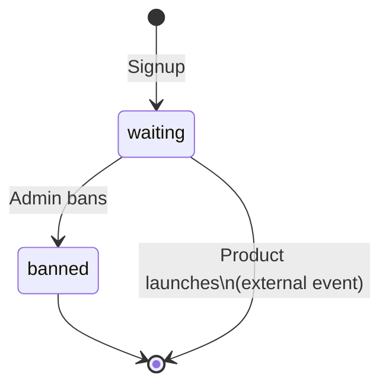
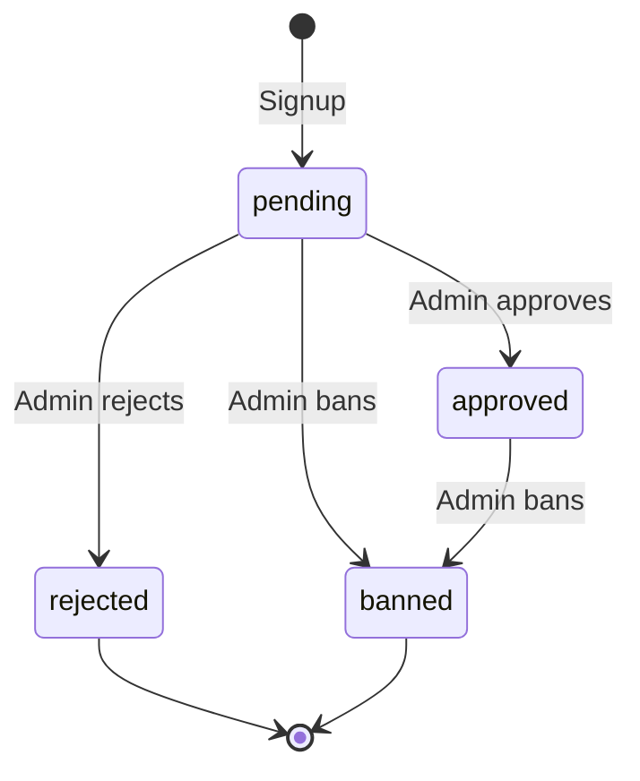
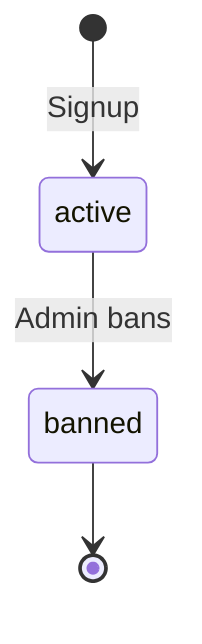

# Waitlist Modes

The `mode` field on a project determines how subscribers enter the waitlist, what status they receive, whether they are assigned a queue position, and how they progress to being "active." Three modes are available.

---

## Comparison Table

| Feature | `prelaunch` | `gated` | `viral` |
|---|---|---|---|
| Initial status | `waiting` | `pending` | `active` |
| Position assigned | Yes (sequential) | No | Yes (sequential) |
| Admin approval required | No | Yes | No |
| Referrals move position | Yes | No (no position) | Yes |
| Leaderboard focus | Optional | Optional | Primary |
| Best for | Ordered early access | Curated invite-only | Maximise viral growth |

---

## Prelaunch Mode

### How Positions Work

When a subscriber signs up in `prelaunch` mode, they receive a sequential position number. The position is calculated as:

```sql
SELECT COALESCE(MAX(position), 0) AS max_pos
FROM subscribers WHERE project_id = ?;
-- new position = max_pos + 1
```

Position 1 is the front of the queue. Positions can decrease (move toward 1) via referral bumps.

### Status Flow



In `prelaunch` mode there is no automated transition out of `waiting`. The product team launches and grants access externally. The admin can individually `ban` a subscriber. The `approved`/`rejected` statuses are not used in this mode.

### Configuration Options

```typescript
{
  mode: "prelaunch",
  referral: {
    enabled: true,
    positionBump: 5,      // Positions moved forward per verified referral
    maxBumps: 10          // Optional cap on total bumps
  },
  maxSubscribers: 5000,   // Optional cap
  requireEmailVerification: false
}
```

### Use Cases

- Software beta launches where you want an ordered queue of early testers.
- Physical product launches where you ship to position 1 first.
- Any scenario where fairness ("I signed up before you") matters.

---

## Gated Access Mode

### How Approval Works

In `gated` mode, new subscribers receive `status = "pending"` and **no position is assigned** (`position = null`). The admin manually reviews each pending subscriber and either approves or rejects them.

`shouldAssignPosition(mode)` returns `false` for `gated`, so the position-assignment SQL block is skipped entirely.

### Status Flow



### Admin Workflow

1. Admin logs in and navigates to the subscribers list.
2. Filters by `status=pending`.
3. Reviews each subscriber's email, name, and metadata (custom fields).
4. Approves or rejects individually via `PATCH /api/v1/admin/subscribers/:id` or in bulk via `POST /api/v1/admin/subscribers/bulk`.

When approved:
- Status changes to `approved`.
- The `subscriber.approved` webhook event fires (if an endpoint is registered).
- The application can use this event to send an invite email.

### Use Cases

- Exclusive beta programs where you control who gets in.
- Community platforms requiring background checks.
- Enterprise products requiring sales qualification.

---

## Viral Growth Mode

### Leaderboard Focus

In `viral` mode, new subscribers receive `status = "active"` immediately — there is no waiting or approval step. Everyone is in from the start. The competitive mechanic is the leaderboard: who has the most referrals.

### Gamification Features

- Every subscriber gets a referral code immediately.
- Position bumps still apply (subscribers climb the leaderboard in position terms).
- Reward tiers incentivise reaching referral milestones.
- The `GET /api/v1/leaderboard` endpoint (Redis-cached for 60 s) shows top referrers.

### Status Flow



### Use Cases

- Consumer apps where viral growth is the primary goal.
- Contests or giveaways where ranking by referrals determines prizes.
- Community launches where all signups are welcome and social sharing is the mechanic.

---

## Switching Modes Mid-Waitlist

Mode is stored both in `projects.mode` (a dedicated column) and inside `projects.config` (as part of the JSON config). The `PUT /api/v1/admin/project/:id` endpoint performs a **merge** of the provided config over the existing config, so mode can technically be updated.

**Practical implications of switching:**

| From → To | Effect |
|---|---|
| `prelaunch` → `gated` | Existing `waiting` subscribers keep their status. New signups get `pending` and no position. Referral bumps on existing subscribers still apply. |
| `prelaunch` → `viral` | Existing `waiting` subscribers keep their status. New signups get `active` and a position. |
| `gated` → `prelaunch` | Existing `pending` subscribers keep `null` position. New signups get `waiting` and sequential positions. |
| Any → `viral` | New signups become `active` immediately. |

There is no automated backfill — switching modes does not retroactively change existing subscriber statuses or assign positions to `gated` subscribers. If you need that, run a manual SQL migration.

---

## Config Reference

All options are validated by `projectConfigSchema` in `packages/shared/src/schemas.ts`.

| Field | Type | Required | Default | Description |
|---|---|---|---|---|
| `mode` | `"prelaunch" \| "gated" \| "viral"` | Yes | — | Controls initial status and position assignment |
| `name` | `string` | Yes | — | Human-readable project name (1–200 chars) |
| `maxSubscribers` | `number` | No | — | Hard cap on total subscribers; 409 returned when reached |
| `requireEmailVerification` | `boolean` | Yes | `false` | If true, referrals are created with `verified=false` until email confirmed |
| `customFields` | `FieldDefinition[]` | No | — | Up to 20 custom fields collected at signup (stored in `metadata`) |
| `referral.enabled` | `boolean` | Yes | — | Whether referral codes are accepted at signup |
| `referral.positionBump` | `number` | Yes | `1` | Positions moved forward per verified referral (0–100) |
| `referral.maxBumps` | `number` | No | — | Cap on total position bumps a single subscriber can receive |
| `rewards` | `RewardTierConfig[]` | Yes | `[]` | Up to 10 reward tiers |
| `deduplication` | `"email" \| "email+ip"` | Yes | `"email"` | Duplicate detection strategy (`email+ip` not yet enforced in current code) |
| `rateLimit.window` | `string` | Yes | `"1m"` | Time window for signup rate limiting (format: `\d+[smh]`) |
| `rateLimit.max` | `number` | Yes | `10` | Max signups per IP per window |

### Custom Field Types

```typescript
interface FieldDefinition {
  name: string;                              // Internal field name
  type: "text" | "number" | "select" | "url";
  label: string;                             // Display label
  required: boolean;
  options?: string[];                        // For "select" type only
}
```
