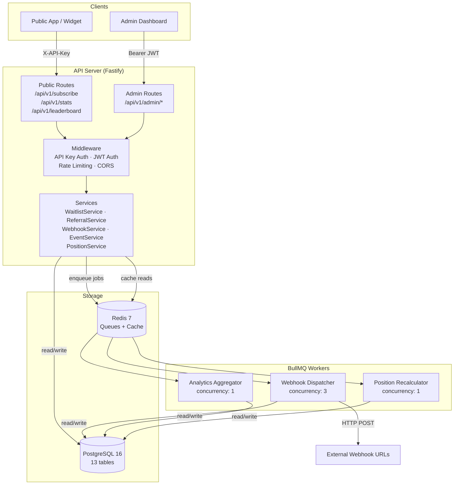
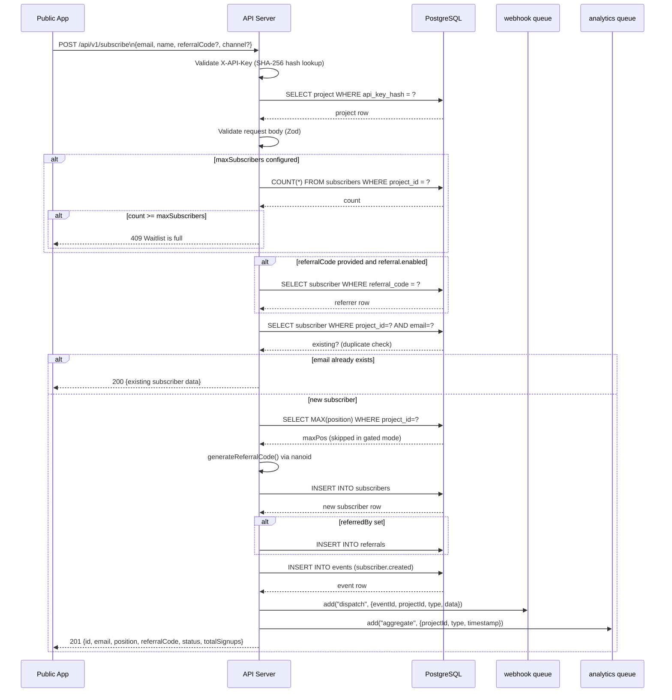
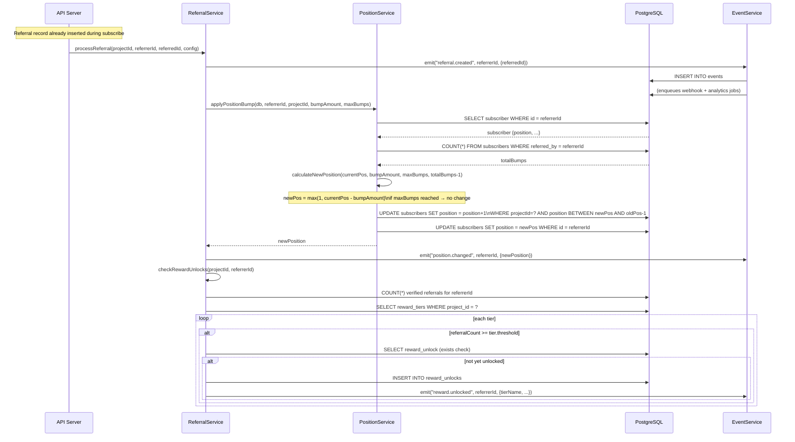
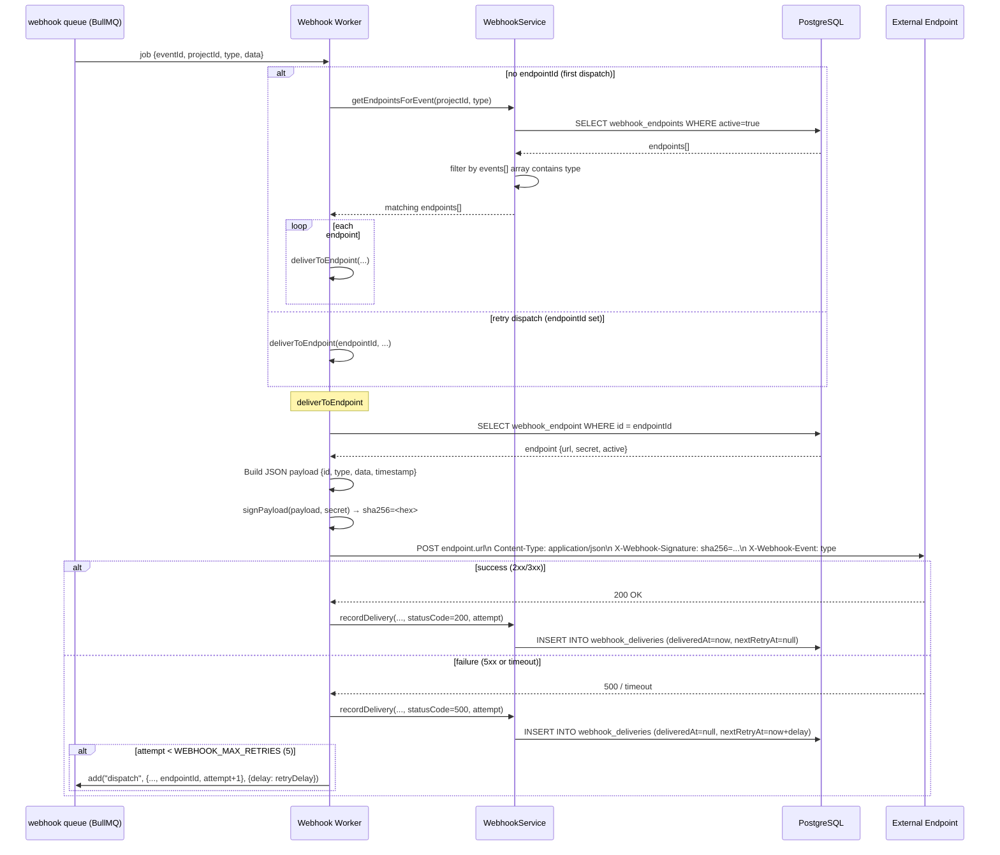
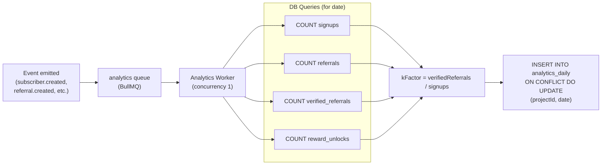
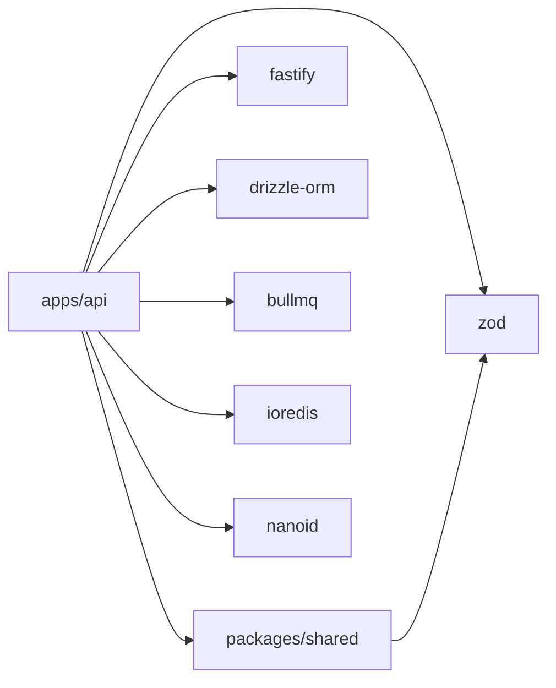

# System Architecture Overview

The Waitlist & Viral Referral System is a multi-tenant SaaS platform that allows developers to embed a waitlist with built-in viral referral mechanics, reward tiers, A/B experiments, and webhook notifications into any product. A single API server handles all workloads; background processing is delegated to three BullMQ workers that share the same Redis instance.

---

## High-Level Architecture

---

## Component Breakdown

### API Server (`apps/api`)

The API server is a [Fastify](https://fastify.dev/) application written in TypeScript. It starts in `apps/api/src/server.ts`, which wires together every subsystem before the server begins listening.

**Startup sequence:**
1. Validate required environment variables (`DATABASE_URL`, `REDIS_URL`, `ADMIN_JWT_SECRET`).
2. Create a Drizzle ORM database client and an ioredis client.
3. Decorate the Fastify instance with `db` and `redis` so all routes can access them.
4. Register `@fastify/cors` (origin list from `CORS_ORIGINS`) and `@fastify/rate-limit` (100 req/min per IP, backed by Redis).
5. Register `@fastify/jwt` and attach the `authenticateAdmin` decorator.
6. Register all routes.
7. Register the three BullMQ workers in-process.
8. Attach `SIGTERM`/`SIGINT` handlers for graceful shutdown (30 s timeout).

**Route groups:**

| Group | Auth | Prefix |
|---|---|---|
| Subscribe | API Key | `/api/v1/subscribe` |
| Stats | API Key | `/api/v1/stats` |
| Leaderboard | API Key | `/api/v1/leaderboard` |
| Admin Auth | None (setup) / None (login) | `/api/v1/admin/auth` |
| Admin Projects | JWT | `/api/v1/admin/project` |
| Admin Subscribers | JWT | `/api/v1/admin/subscribers` |
| Admin Rewards | JWT | `/api/v1/admin/rewards` |
| Admin Webhooks | JWT | `/api/v1/admin/webhooks` |
| Admin Experiments | JWT | `/api/v1/admin/experiments` |
| Admin Analytics | JWT | `/api/v1/admin/analytics` |
| Health | None | `/health` |

### Background Workers (`apps/api/src/workers`)

Three BullMQ workers run in the same Node.js process as the API server. They share the ioredis connection. Each worker is created via `createWorker()` in `lib/queue.ts`.

| Worker | Queue name | Concurrency | Responsibility |
|---|---|---|---|
| Webhook Dispatcher | `webhook` | 3 | Deliver webhook payloads; retry on failure |
| Analytics Aggregator | `analytics` | 1 | Upsert daily analytics rows |
| Position Recalculator | `position` | 1 | Apply position bumps after referral |

### Shared Package (`packages/shared`)

Contains types, Zod validation schemas, and constants shared between the API and any frontend packages.

| File | Contents |
|---|---|
| `types.ts` | TypeScript interfaces and union types |
| `schemas.ts` | Zod schemas for request validation |
| `constants.ts` | Feature flags, retry delays, cache TTLs, disposable domain list |

---

## Data Flow Diagrams

### Signup Flow

### Referral Flow

### Webhook Delivery Flow

### Analytics Aggregation Flow

---

## Package Dependency Graph

---

## Technology Decisions

| Technology | Version | Rationale |
|---|---|---|
| **Fastify** | 4.x | Lower overhead than Express; built-in schema validation hooks; plugin system maps cleanly to route groups |
| **Drizzle ORM** | latest | Fully type-safe SQL builder; zero-overhead at runtime compared to ActiveRecord ORMs; migrations via drizzle-kit |
| **PostgreSQL** | 16 | ACID guarantees needed for position arithmetic; `ON CONFLICT DO UPDATE` for idempotent analytics upserts |
| **Redis / ioredis** | 7 / latest | BullMQ requires Redis for job queues; doubles as a response cache for leaderboard (60 s TTL) and stats (300 s TTL) |
| **BullMQ** | latest | Battle-tested Redis-backed queue; built-in delayed jobs (used for webhook retry backoff); per-queue concurrency |
| **nanoid** | latest | Cryptographically random, URL-safe referral codes; custom alphabet (alphanumeric) for readability |
| **Zod** | 3.x | Single source of truth for validation schemas shared between API and frontend; `.safeParse()` gives structured errors |
| **pnpm workspaces + Turborepo** | 9.x / latest | Monorepo toolchain; turborepo handles build caching and pipeline ordering |
| **Docker multi-stage build** | - | `deps` → `build` → `production` stages keep the final image small; dumb-init for proper PID 1 signal handling |
