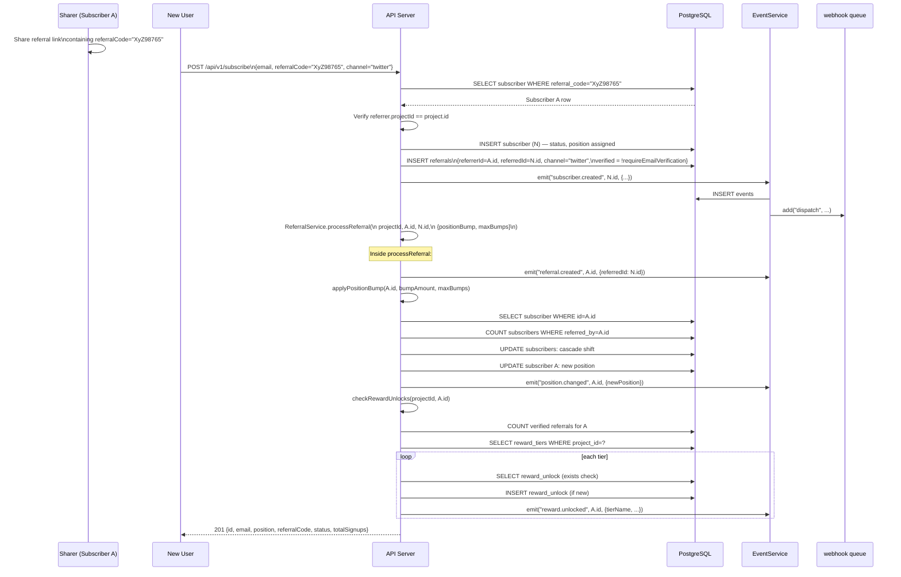

# Referral Engine

The referral engine is the core viral mechanic of the system. It handles code generation, referral tracking, position bumping, reward tier unlocking, and fraud prevention.

---

## Referral Flow



---

## Referral Code Generation

Referral codes are generated in `apps/api/src/lib/referral-code.ts` using [nanoid](https://github.com/ai/nanoid) with a custom alphabet.

```typescript
import { nanoid, customAlphabet } from "nanoid";
import { REFERRAL_CODE_LENGTH } from "@waitlist/shared"; // = 8

const alphabet = "0123456789ABCDEFGHIJKLMNOPQRSTUVWXYZabcdefghijklmnopqrstuvwxyz";
const generate = customAlphabet(alphabet, REFERRAL_CODE_LENGTH);

export function generateReferralCode(): string {
  return generate();
}
```

**Properties:**
- Length: 8 characters (constant `REFERRAL_CODE_LENGTH = 8`)
- Alphabet: 62 characters (digits + uppercase + lowercase)
- Collision space: 62^8 = ~218 trillion combinations
- Globally unique: enforced by the `referral_code` unique index
- URL-safe: no special characters

Codes are validated at the API boundary with regex `/^[a-zA-Z0-9]{6,12}$/` (the schema allows 6–12 chars for flexibility, but generation always produces 8).

---

## Referral Chain Tracking

The referral chain is encoded in two places:

1. **`subscribers.referred_by`** — a self-referential foreign key pointing to the subscriber who invited this person. This is `ON DELETE SET NULL`, so deleting a referrer does not delete their referred subscribers.

2. **`referrals` table** — an explicit join table with one row per referral, including `channel` and `verified` status. This table has a unique index on `referred_id`, enforcing that each subscriber can only be referred once.

The chain can be traversed recursively using the `referred_by` column:

```sql
-- Find full referral chain for a subscriber
WITH RECURSIVE chain AS (
  SELECT id, email, referred_by, 0 AS depth
  FROM subscribers WHERE id = $leaf_subscriber_id
  UNION ALL
  SELECT s.id, s.email, s.referred_by, c.depth + 1
  FROM subscribers s
  INNER JOIN chain c ON s.id = c.referred_by
)
SELECT * FROM chain ORDER BY depth DESC;
```

---

## Position Bumping Algorithm

The algorithm is implemented in `apps/api/src/services/position.ts`.

### How `bumpAmount` Works

Each verified referral moves the referrer `positionBump` positions closer to the front of the queue. Position 1 is the front.

```typescript
export function calculateNewPosition(
  currentPosition: number,
  bumpAmount: number,
  maxBumps: number | undefined,
  totalBumpsApplied: number = 0
): number {
  if (maxBumps !== undefined && totalBumpsApplied >= maxBumps) {
    return currentPosition; // Cap reached — no change
  }
  return Math.max(1, currentPosition - bumpAmount); // Cannot go below 1
}
```

`totalBumpsApplied` is computed as `(referral count) - 1` because the current referral has already been inserted before the bump is applied.

### `maxBumps` Cap

If `config.referral.maxBumps` is set, a subscriber can only benefit from that many referrals in terms of position movement. The 51st referral of someone with `maxBumps=50` does not move them.

### Cascade Position Updates

When a subscriber moves from position `oldPos` to `newPos` (where `newPos < oldPos`), all subscribers in the range `(newPos, oldPos)` are shifted down by 1 to fill the gap:

```typescript
// Move others down
await db.update(subscribers)
  .set({ position: sql`${subscribers.position} + 1`, updatedAt: new Date() })
  .where(
    and(
      eq(subscribers.projectId, projectId),
      lte(subscribers.position, oldPosition - 1),    // ≤ oldPos - 1
      gt(subscribers.position, newPosition - 1)      // > newPos - 1
    )
  );

// Set the referrer's new position
await db.update(subscribers)
  .set({ position: newPosition, updatedAt: new Date() })
  .where(eq(subscribers.id, subscriberId));
```

**Example with `bumpAmount=3`:**
- Referrer starts at position 10.
- New position = max(1, 10 - 3) = 7.
- Subscribers at positions 7, 8, 9 shift to 8, 9, 10.
- Referrer moves to position 7.
- Total subscribers in project: unchanged.

### Concurrent Bump Handling

Position bumps are applied within a single database transaction (Drizzle does not wrap these in a transaction by default in the current implementation). The Position Recalculator worker has **concurrency 1**, ensuring bumps are serialised through BullMQ. However, when bumps are applied inline during the subscribe request (current behaviour), concurrent requests could theoretically create race conditions. The unique index on `(project_id, email)` prevents duplicate subscribers, but position arithmetic is not wrapped in a serialisable transaction in the current code.

---

## Reward Tier System

### Tier Configuration

Reward tiers are stored in the `reward_tiers` table and referenced in `project.config.rewards`. Each tier has a threshold (number of verified referrals required) and a reward.

```typescript
interface RewardTierConfig {
  name: string;        // Display name
  threshold: number;   // Verified referral count required
  rewardType: "flag" | "code" | "custom";
  rewardValue: string; // The reward itself
}
```

- `flag` — a boolean feature flag name
- `code` — a promo/invite code string
- `custom` — any string value (URL, JSON, etc.)

### Unlock Checking Algorithm

`checkRewardUnlocks` runs after every referral in `ReferralService`:

```typescript
async checkRewardUnlocks(projectId: string, subscriberId: string) {
  // Count verified referrals for this subscriber
  const referralCount = await countVerifiedReferrals(subscriberId);

  // Load all tiers for this project
  const tiers = await db.select().from(rewardTiers)
    .where(eq(rewardTiers.projectId, projectId));

  for (const tier of tiers) {
    if (referralCount >= tier.threshold) {
      // Check if already unlocked (unique index prevents double-insert)
      const existing = await findUnlock(subscriberId, tier.id);
      if (!existing) {
        await db.insert(rewardUnlocks).values({ subscriberId, tierId: tier.id });
        await eventService.emit(projectId, "reward.unlocked", subscriberId, {
          tierName: tier.name,
          rewardType: tier.rewardType,
          rewardValue: tier.rewardValue,
          threshold: tier.threshold,
        });
      }
    }
  }
}
```

The `reward_unlocks_subscriber_tier_idx` UNIQUE index on `(subscriber_id, tier_id)` acts as a hard guard against double-awarding if the check runs concurrently.

### Event on Unlock

A `reward.unlocked` event is emitted for each newly unlocked tier. The webhook system delivers this to all subscribed endpoints, allowing your application to:
- Send a congratulation email with the reward value.
- Grant access to a feature flag.
- Email a promo code.

---

## Fraud Prevention

### Self-Referral Detection

`ReferralService.isSelfReferral()` compares emails case-insensitively:

```typescript
isSelfReferral(referrerEmail: string, referredEmail: string): boolean {
  return referrerEmail.toLowerCase() === referredEmail.toLowerCase();
}
```

This is checked at the service layer. In the current subscribe route, the referrer is looked up by `referral_code`, and the `projectId` is verified to match, preventing cross-project code reuse. Self-referral by email can be prevented by calling `isSelfReferral` before processing.

### Disposable Email Blocklist

A hardcoded list of 10 known disposable email domains in `packages/shared/src/constants.ts`:

```typescript
export const DISPOSABLE_EMAIL_DOMAINS = [
  "mailinator.com", "guerrillamail.com", "tempmail.com", "throwaway.email",
  "yopmail.com", "sharklasers.com", "guerrillamailblock.com", "grr.la",
  "dispostable.com", "trashmail.com",
];
```

`ReferralService.isDisposableEmail(email)` checks by extracting the domain:

```typescript
isDisposableEmail(email: string): boolean {
  const domain = email.split("@")[1]?.toLowerCase();
  return domain ? DISPOSABLE_EMAIL_DOMAINS.includes(domain) : false;
}
```

### Same-IP Detection Within Time Window

`ReferralService.isSameIpRecent()` checks whether any subscriber in the same project signed up from the same IP within a configurable time window (default 1 hour):

```typescript
async isSameIpRecent(projectId: string, ip: string, windowMs = 3_600_000): Promise<boolean> {
  const since = new Date(Date.now() - windowMs);
  const [result] = await db
    .select({ count: sql`count(*)` })
    .from(subscribers)
    .where(
      and(
        eq(subscribers.projectId, projectId),
        eq(subscribers.signupIp, ip),
        gte(subscribers.createdAt, since)
      )
    );
  return Number(result?.count ?? 0) > 0;
}
```

This detects scenarios where someone signs up multiple times from the same IP to inflate their own referral count.

### Rate Limiting

Global rate limiting at the Fastify level: 100 requests/minute per IP (via `@fastify/rate-limit` backed by Redis). This prevents automated bulk signups.

---

## Analytics

### K-Factor Calculation

K-factor is calculated in the Analytics Worker as:

```
kFactor = verifiedReferrals / signups
```

Where `signups` and `verifiedReferrals` are counts for the same calendar day. A K-factor ≥ 1 means the waitlist is growing virally (each subscriber invites at least one verified person per day on average).

### Channel Tracking

The `channel` field on both `subscribers` and `referrals` records which share surface was used (twitter, facebook, linkedin, whatsapp, email, copy, other). The admin analytics endpoint `GET /api/v1/admin/analytics/channels` groups referrals by channel to show which surfaces drive the most signups.

### Cohort Analysis

The `analytics_cohorts` table stores weekly cohort data. `cohort_week` is an ISO date string for the Monday of the week the cohort signed up. Columns track:
- How many signed up that week (`size`)
- How many referrals they generated within 1, 7, and 30 days
- Referral depth distribution (direct, 2nd-degree, 3rd-degree+)

This data is populated by an external aggregation job (not currently automated — the table is available for manual or scheduled updates).
