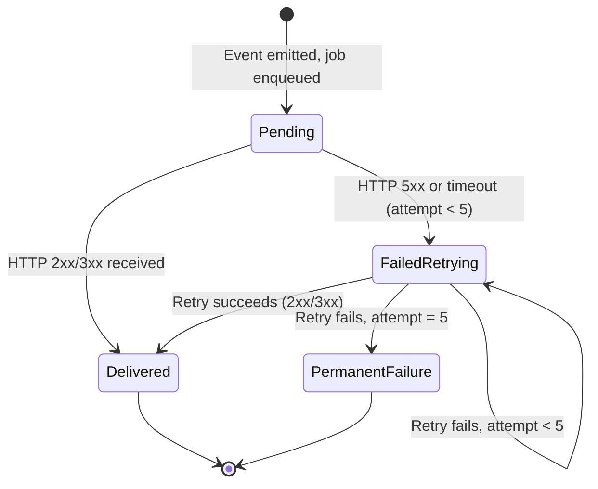

# Webhook System

The webhook system allows you to receive real-time HTTP notifications when events occur in your waitlist. You register one or more endpoint URLs with a signing secret and a list of event types to subscribe to. When an event fires, the Webhook Dispatcher worker POSTs a signed JSON payload to every matching active endpoint.

---

## All 9 Webhook Events

| Event Type | Fired When |
|---|---|
| `subscriber.created` | A new subscriber joins the waitlist |
| `subscriber.verified` | A subscriber's email is verified |
| `subscriber.approved` | A subscriber's status changes to `approved` (gated mode) |
| `subscriber.rejected` | A subscriber's status changes to `rejected` |
| `referral.created` | A new referral record is inserted |
| `reward.unlocked` | A subscriber crosses a reward tier threshold |
| `position.changed` | A subscriber's queue position changes (after a referral bump) |
| `experiment.assigned` | A subscriber is assigned to an A/B experiment variant |
| `waitlist.milestone` | A configurable total-signup milestone is reached |

---

## Payload Structure

Every webhook POST body has this envelope:

```typescript
interface WebhookPayload {
  id: string;        // Unique UUID for this delivery attempt
  type: string;      // Event type e.g. "subscriber.created"
  data: Record<string, unknown>; // Event-specific data (see below)
  timestamp: string; // ISO 8601 datetime
}
```

### `subscriber.created`
```json
{
  "id": "a1b2c3d4-...",
  "type": "subscriber.created",
  "data": {
    "subscriberId": "550e8400-...",
    "email": "jane@example.com",
    "position": 42,
    "referredBy": "ref-uuid-or-null",
    "channel": "twitter"
  },
  "timestamp": "2025-03-30T12:00:00.000Z"
}
```

### `referral.created`
```json
{
  "id": "b2c3d4e5-...",
  "type": "referral.created",
  "data": {
    "subscriberId": "referrer-uuid",
    "referredId": "new-subscriber-uuid"
  },
  "timestamp": "2025-03-30T12:01:00.000Z"
}
```

### `reward.unlocked`
```json
{
  "id": "c3d4e5f6-...",
  "type": "reward.unlocked",
  "data": {
    "subscriberId": "subscriber-uuid",
    "tierName": "Beta Access",
    "rewardType": "code",
    "rewardValue": "BETA-XYZ-2025",
    "threshold": 5
  },
  "timestamp": "2025-03-30T12:02:00.000Z"
}
```

### `position.changed`
```json
{
  "id": "d4e5f6g7-...",
  "type": "position.changed",
  "data": {
    "subscriberId": "subscriber-uuid",
    "newPosition": 37
  },
  "timestamp": "2025-03-30T12:03:00.000Z"
}
```

### `subscriber.approved`
```json
{
  "id": "e5f6g7h8-...",
  "type": "subscriber.approved",
  "data": {
    "subscriberId": "subscriber-uuid",
    "email": "jane@example.com",
    "position": null,
    "referredBy": null,
    "channel": null
  },
  "timestamp": "2025-03-30T12:04:00.000Z"
}
```

> **Note:** `subscriber.verified`, `subscriber.rejected`, `experiment.assigned`, and `waitlist.milestone` follow the same envelope shape with their respective event-specific data fields.

---

## HMAC-SHA256 Signature Verification

Every request includes the header:
```
X-Webhook-Signature: sha256=<hex-digest>
```

The signature is computed over the **raw request body string** using HMAC-SHA256 with your endpoint's `secret`.

### Implementation (from `apps/api/src/services/webhook.ts`)

```typescript
import { createHmac, timingSafeEqual } from "node:crypto";

function signPayload(payload: string, secret: string): string {
  const hmac = createHmac("sha256", secret).update(payload).digest("hex");
  return `sha256=${hmac}`;
}

function verifySignature(payload: string, secret: string, signature: string): boolean {
  const expected = signPayload(payload, secret);
  try {
    return timingSafeEqual(Buffer.from(expected), Buffer.from(signature));
  } catch {
    return false;
  }
}
```

`timingSafeEqual` prevents timing attacks by comparing the two buffers in constant time.

### Verify in Node.js (receiver side)

```javascript
import { createHmac, timingSafeEqual } from "crypto";

function verifyWebhook(rawBody, secret, signatureHeader) {
  const expected = "sha256=" + createHmac("sha256", secret)
    .update(rawBody, "utf8")
    .digest("hex");

  try {
    return timingSafeEqual(
      Buffer.from(expected, "utf8"),
      Buffer.from(signatureHeader, "utf8")
    );
  } catch {
    return false;
  }
}

// Express example
app.post("/webhooks/waitlist", express.raw({ type: "application/json" }), (req, res) => {
  const sig = req.headers["x-webhook-signature"];
  if (!verifyWebhook(req.body, process.env.WEBHOOK_SECRET, sig)) {
    return res.status(401).send("Invalid signature");
  }
  const event = JSON.parse(req.body);
  console.log("Received event:", event.type);
  res.status(200).send("OK");
});
```

### Verify in Python (receiver side)

```python
import hmac
import hashlib

def verify_webhook(raw_body: bytes, secret: str, signature_header: str) -> bool:
    expected = "sha256=" + hmac.new(
        secret.encode("utf-8"),
        raw_body,
        hashlib.sha256
    ).hexdigest()
    return hmac.compare_digest(expected, signature_header)

# FastAPI example
from fastapi import FastAPI, Request, HTTPException

app = FastAPI()

@app.post("/webhooks/waitlist")
async def handle_webhook(request: Request):
    raw_body = await request.body()
    signature = request.headers.get("x-webhook-signature", "")

    if not verify_webhook(raw_body, WEBHOOK_SECRET, signature):
        raise HTTPException(status_code=401, detail="Invalid signature")

    event = await request.json()
    print(f"Received: {event['type']}")
    return {"ok": True}
```

> **Important:** Always read the raw request body for signature verification **before** JSON-parsing. Parsing and re-stringifying changes whitespace and field order, breaking the signature.

---

## Retry Policy

When a delivery attempt fails (HTTP 5xx response or network/timeout error), the system schedules a retry using exponential backoff via BullMQ's `delay` option.

| Attempt | Delay Before Retry |
|---|---|
| 1 (initial) | — |
| 2 | 1 minute |
| 3 | 5 minutes |
| 4 | 30 minutes |
| 5 | 2 hours |

After attempt 5 (defined as `WEBHOOK_MAX_RETRIES = 5`), no further retries occur. The constants come from `packages/shared/src/constants.ts`:

```typescript
export const WEBHOOK_MAX_RETRIES = 5;
export const WEBHOOK_RETRY_DELAYS = [60_000, 300_000, 1_800_000, 7_200_000, 43_200_000];
// delays[attempt - 1] is the delay before that attempt
```

Each retry is a new BullMQ job with a `delay` equal to the milliseconds until the next attempt time. The `attempt` counter increments with each job.

**What triggers a retry:**
- `statusCode === null` — network error, DNS failure, timeout (10 s timeout via `AbortSignal.timeout`)
- `statusCode >= 500` — server error from the endpoint

**What does NOT trigger a retry:**
- HTTP 4xx — treated as permanent failure (endpoint is misconfigured)
- HTTP 2xx or 3xx — success

---

## Delivery Status Lifecycle



Each delivery attempt creates one row in `webhook_deliveries`:
- `delivered_at` is set when `status_code` is 2xx/3xx.
- `next_retry_at` is set when a retry is scheduled.
- `delivered_at = null` and `next_retry_at = null` means permanent failure.

---

## Registering Webhook Endpoints

Use the admin API to register an endpoint:

```bash
curl -X POST http://localhost:3400/api/v1/admin/webhooks \
  -H "Authorization: Bearer $ADMIN_JWT" \
  -H "Content-Type: application/json" \
  -d '{
    "projectId": "<project-uuid>",
    "url": "https://myapp.com/webhooks/waitlist",
    "secret": "my-super-secret-at-least-16-chars",
    "events": [
      "subscriber.created",
      "referral.created",
      "reward.unlocked",
      "position.changed"
    ]
  }'
```

The endpoint is immediately active. To pause deliveries without deleting the endpoint, you can soft-disable it — the `active` flag can be managed via the admin UI or by deleting and recreating the endpoint.

---

## Testing Webhooks Locally

### Option 1: Use a tunnel (ngrok / localtunnel)

```bash
# Start a tunnel to your local server
npx localtunnel --port 3000

# Register the tunnel URL as your webhook endpoint
curl -X POST http://localhost:3400/api/v1/admin/webhooks \
  -H "Authorization: Bearer $TOKEN" \
  -H "Content-Type: application/json" \
  -d '{
    "projectId": "<uuid>",
    "url": "https://your-tunnel-url.loca.lt/webhooks",
    "secret": "test-secret-16chars",
    "events": ["subscriber.created"]
  }'

# Trigger a signup to see the webhook fire
curl -X POST http://localhost:3400/api/v1/subscribe \
  -H "X-API-Key: wl_pk_..." \
  -H "Content-Type: application/json" \
  -d '{"email": "test@example.com"}'
```

### Option 2: Use a local mock server

```javascript
// mock-webhook-server.js
import http from "http";

http.createServer((req, res) => {
  let body = "";
  req.on("data", chunk => body += chunk);
  req.on("end", () => {
    console.log("Headers:", req.headers);
    console.log("Body:", JSON.parse(body));
    res.writeHead(200);
    res.end("OK");
  });
}).listen(4000, () => console.log("Mock webhook server on :4000"));
```

---

## Security Best Practices

1. **Always verify signatures.** Every delivery includes `X-Webhook-Signature`. Reject requests where the signature does not match.

2. **Use a strong secret.** The secret must be 16–128 characters. Use a cryptographically random string of at least 32 characters.

3. **Respond quickly.** The webhook worker waits up to **10 seconds** for a response (hard `AbortSignal.timeout`). Respond with `200 OK` immediately, then process asynchronously.

4. **Idempotency.** Each delivery attempt has a unique `id` field in the payload. Store processed IDs and skip duplicates — retries will re-deliver the same logical event with the same `type` and `data`, but a different `id`.

5. **HTTPS only.** Never register an `http://` URL in production. The webhook worker sends your signing secret in the HMAC computation — an attacker observing traffic could forge payloads.

6. **Rotate secrets.** If a secret is compromised, delete the webhook endpoint and create a new one with a new secret.

7. **Monitor delivery history.** Use `GET /api/v1/admin/webhooks/:id/deliveries` to audit past delivery attempts and diagnose failures.
