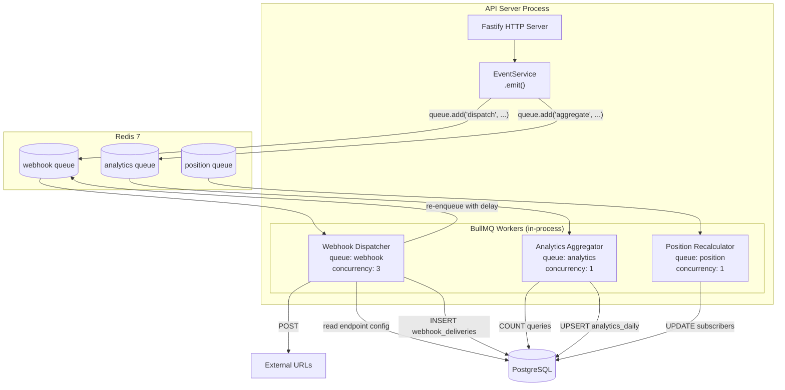
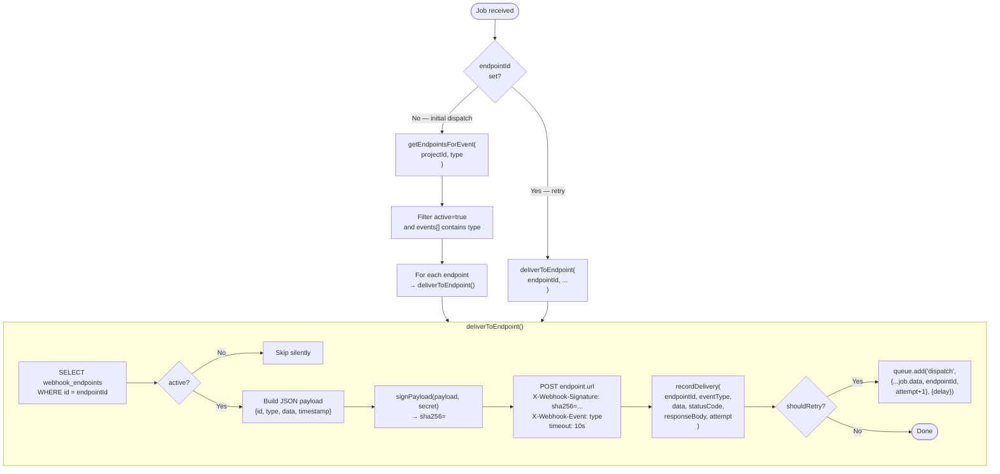

# Background Workers

The system uses **BullMQ** for all background processing. Three workers run in-process alongside the Fastify API server. They share the same ioredis connection.

Workers are registered in `apps/api/src/workers/index.ts` via `registerWorkers(db, redis)`, which is called during server startup. The returned `closeAll()` function is invoked on `SIGTERM`/`SIGINT` for graceful shutdown.

---

## Worker Architecture



---

## Queue Creation

Both queues and workers are created through thin wrappers in `apps/api/src/lib/queue.ts`:

```typescript
// lib/queue.ts
export function createQueue(name: string, connection: Redis): Queue {
  return new Queue(name, { connection });
}

export function createWorker<T>(
  name: string,
  processor: Processor<T>,
  connection: Redis,
  concurrency = 1
): Worker<T> {
  return new Worker(name, processor, { connection, concurrency });
}
```

Only the `webhook` queue is exposed back to the rest of the app (so the webhook worker can enqueue retry jobs). The `analytics` and `position` queues are internal to `registerWorkers`.

---

## Webhook Dispatcher Worker

**File:** `apps/api/src/workers/webhook.ts`
**Queue name:** `webhook`
**Concurrency:** 3 (three jobs processed simultaneously)

### Job Data Format

```typescript
interface WebhookJobData {
  eventId: string;                    // The events table row ID
  projectId: string;                  // Project UUID
  type: string;                       // Event type e.g. "subscriber.created"
  data: Record<string, unknown>;      // Event payload data
  endpointId?: string;                // Set only on retry jobs
  attempt?: number;                   // Attempt number; defaults to 1
}
```

### Processing Logic



### Retry Mechanism

`shouldRetry` is true when `(statusCode === null || statusCode >= 500) && attempt < 5`.

The delay is calculated from `WEBHOOK_RETRY_DELAYS[attempt - 1]`:
- Attempt 1 → attempt 2: 60,000 ms (1 min)
- Attempt 2 → attempt 3: 300,000 ms (5 min)
- Attempt 3 → attempt 4: 1,800,000 ms (30 min)
- Attempt 4 → attempt 5: 7,200,000 ms (2 h)
- Attempt 5: no retry (max reached)

BullMQ's `{ delay }` option causes the job to sit in the delayed set in Redis until the scheduled time, then moves to the waiting queue for a worker to pick up.

---

## Analytics Aggregator Worker

**File:** `apps/api/src/workers/analytics.ts`
**Queue name:** `analytics`
**Concurrency:** 1 (serialised to avoid conflicting upserts)

### Job Data Format

```typescript
interface AnalyticsJobData {
  projectId: string;   // Project UUID
  type: string;        // Event type that triggered aggregation
  timestamp: string;   // ISO 8601 datetime of the event
}
```

### Aggregation Logic

The worker extracts the date from `timestamp.slice(0, 10)` (giving `YYYY-MM-DD`), computes day boundaries (`00:00:00Z` to `23:59:59.999Z`), then runs four parallel COUNT queries:

```
signups          = COUNT(*) FROM subscribers WHERE project_id=? AND created_at BETWEEN dayStart AND dayEnd
referrals        = COUNT(*) FROM referrals WHERE project_id=? AND created_at BETWEEN dayStart AND dayEnd
verifiedReferrals= COUNT(*) FROM referrals WHERE project_id=? AND verified=true AND created_at BETWEEN ...
rewardUnlocks    = COUNT(*) FROM reward_unlocks WHERE unlocked_at BETWEEN dayStart AND dayEnd
kFactor          = signups > 0 ? verifiedReferrals / signups : 0 (rounded to 2dp)
```

Note: `reward_unlocks` is counted without `project_id` filtering — it relies on subscriber cascade.

### Upsert Strategy

```sql
INSERT INTO analytics_daily (project_id, date, signups, referrals, verified_referrals, k_factor, reward_unlocks)
VALUES (...)
ON CONFLICT (project_id, date) DO UPDATE SET
  signups = EXCLUDED.signups,
  referrals = EXCLUDED.referrals,
  verified_referrals = EXCLUDED.verified_referrals,
  k_factor = EXCLUDED.k_factor,
  reward_unlocks = EXCLUDED.reward_unlocks;
```

This is idempotent — re-running the job for the same date always produces correct aggregate counts because it re-queries from the source tables rather than incrementing.

### Schedule

There is no cron schedule. The worker fires on-demand — every time `EventService.emit()` is called, an analytics job is enqueued. Because concurrency is 1, jobs process sequentially, preventing double-writes. Because the upsert is idempotent, multiple jobs for the same date simply recompute and write the same values.

---

## Position Recalculator Worker

**File:** `apps/api/src/workers/position.ts`
**Queue name:** `position`
**Concurrency:** 1 (serialised to prevent race conditions on position arithmetic)

### Job Data Format

```typescript
interface PositionJobData {
  projectId: string;
  subscriberId: string;
  bumpAmount: number;
  maxBumps?: number;
}
```

### Processing Logic

The worker is a thin delegator to `applyPositionBump()` in `apps/api/src/services/position.ts`:

```typescript
export function createPositionProcessor(db: Database) {
  return async function processPosition(job: Job<PositionJobData>) {
    const { projectId, subscriberId, bumpAmount, maxBumps } = job.data;
    await applyPositionBump(db, subscriberId, projectId, bumpAmount, maxBumps);
  };
}
```

### Position Bump Algorithm

See the full algorithm in `services/position.ts`. Summary:

1. Fetch the subscriber's current `position`.
2. Count how many subscribers currently have `referred_by = subscriberId` (total bumps already applied).
3. Call `calculateNewPosition(currentPos, bumpAmount, maxBumps, totalBumps - 1)`:
   - If `maxBumps` is set and `totalBumpsApplied >= maxBumps` → return `currentPos` unchanged.
   - Otherwise → `Math.max(1, currentPos - bumpAmount)`.
4. If position unchanged → return early.
5. **Cascade update:** move all subscribers whose position is in the range `(newPos - 1, oldPos - 1]` down by 1:
   ```sql
   UPDATE subscribers SET position = position + 1
   WHERE project_id = ? AND position <= oldPos - 1 AND position > newPos - 1
   ```
6. Set the referrer's position to `newPos`.

This preserves the density of the queue — no gaps are created when a subscriber moves up.

**Example:** Referrer is at position 10, bump amount is 3. New position = 7. Subscribers at positions 7, 8, 9 all shift to 8, 9, 10.

### Concurrency Note

Although the Position worker has concurrency 1, note that the current implementation applies the bump synchronously inside `ReferralService.processReferral()` (not via the queue), so the Position worker is available for future decoupling. Position bumps during signup are applied in-request.

---

## BullMQ Queue Configuration

Queues are created with default BullMQ settings (no custom `defaultJobOptions`). Important defaults:

| Setting | Default | Notes |
|---|---|---|
| `removeOnComplete` | false | Completed jobs remain in Redis for inspection |
| `removeOnFail` | false | Failed jobs remain for debugging |
| `attempts` | 1 | BullMQ-level retries are not used; the webhook worker handles its own retry logic by re-enqueuing |
| `backoff` | none | Not configured at BullMQ level |

Redis connection uses `maxRetriesPerRequest: null` (ioredis setting) to prevent BullMQ from hitting connection retry limits.

---

## Monitoring and Debugging Workers

### Bull Board (recommended)

Install [Bull Board](https://github.com/felixmosh/bull-board) as a dev tool to inspect queues visually:

```bash
pnpm add @bull-board/fastify @bull-board/api
```

### Manual inspection via Redis CLI

```bash
# Connect to Redis
redis-cli -p 6381  # local Docker port

# Count waiting jobs in webhook queue
LLEN bull:webhook:wait

# Count delayed jobs (pending retries)
ZCARD bull:webhook:delayed

# Count failed jobs
ZCARD bull:webhook:failed

# Inspect a failed job (get job IDs first)
ZRANGE bull:webhook:failed 0 -1 WITHSCORES
HGETALL bull:webhook:<job-id>
```

### Graceful shutdown

`registerWorkers()` returns `closeAll()`, which is called on `SIGTERM`/`SIGINT`:

```typescript
async closeAll() {
  await Promise.all(workers.map((w) => w.close()));
  await webhookQueue.close();
}
```

`Worker.close()` waits for currently-running jobs to finish before shutting down. The overall shutdown timeout is 30 seconds (enforced in `server.ts`).
